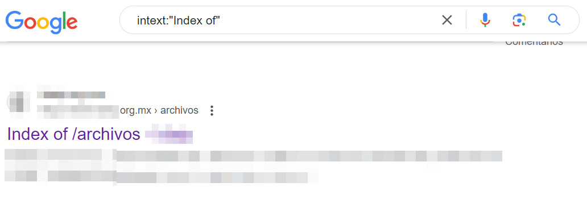
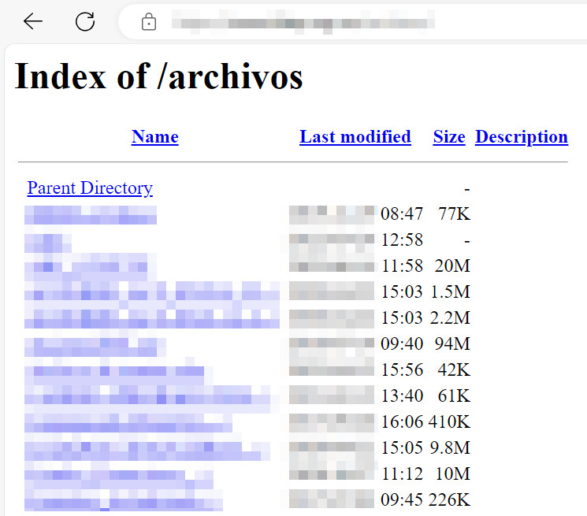

# OSINT
OSINT (Open Source Intelligence), se refiere a la recopilación y análisis de información que está disponible públicamente para obtener conocimientos relevantes y útiles sobre un objetivo en particular, por ejemplo una empresa a auditar. Esta busqueda y recopilación de datos se realiza en paginas de internet, foros, redes sociales y bases de datos accesibles sin necesidad de consultar fuentes confidenciales.

## Google dorks
El principal motor de busqueda del mundo ofrece filtros en sus resultados, una busqueda refinada podria llevarnos a encontrar subdominios, documentos alojados en servidores, suplantacion de paginas, credenciales en texto plano, etc.

A continuación listo los principales filtros y su uso:

```inurl:``` Este filtro se utiliza para encontrar solo resultados donde nuestra palabra clave se encuentre en la url, es util para encontrar paginas de una organizacion en especial, noticias sobre alguna organizacion, subdominios e incluso paginas de login, por ejemplo: ```inurl:login.php```


```ìntext:``` Este filtro se utiliza cuando quieres que en el cuerpo de la pagina aparezcan palabra clave, el uso comun de este filtro es la busqueda de directory listing para encontrar archivos disponibles que contengan informacion como contraseñas o archivos de respaldo de la organizacion a auditar, por ejemplo ```inurl:"Index of"```



Y obtenemos directory listing



La lista de los filtros mas utilizados y su uso a continuación: 

### Operadores Básicos

- **`site:`**
  - **Uso**: `site:ejemplo.com palabra clave`
  - **Función**: Limita los resultados a un dominio específico. Ejemplo: `site:cnn.com tecnología`.

- **`intitle:`**
  - **Uso**: `intitle:palabra clave`
  - **Función**: Muestra resultados donde la palabra clave aparece en el título de la página. Ejemplo: `intitle:vacaciones`.

- **`inurl:`**
  - **Uso**: `inurl:palabra clave`
  - **Función**: Muestra resultados donde la palabra clave aparece en la URL. Ejemplo: `inurl:recetas`.

- **`allintitle:`**
  - **Uso**: `allintitle:palabras clave`
  - **Función**: Muestra resultados donde todas las palabras clave están en el título de la página. Ejemplo: `allintitle:restaurantes veganos`.

- **`allinurl:`**
  - **Uso**: `allinurl:palabras clave`
  - **Función**: Muestra resultados donde todas las palabras clave están en la URL. Ejemplo: `allinurl:productos electrónicos`.

- **`intext:`**
  - **Uso**: `intext:palabra clave`
  - **Función**: Muestra resultados donde la palabra clave aparece en el texto de la página. Ejemplo: `intext:guía de viaje`.

- **`allintext:`**
  - **Uso**: `allintext:palabras clave`
  - **Función**: Muestra resultados donde todas las palabras clave están en el texto de la página. Ejemplo: `allintext:planificación financiera`.

- **`filetype:`**
  - **Uso**: `filetype:extensión palabra clave`
  - **Función**: Muestra resultados que son de un tipo de archivo específico (como PDF, DOC, XLS). Ejemplo: `filetype:pdf informe anual`.

- **`cache:`**
  - **Uso**: `cache:URL`
  - **Función**: Muestra la versión en caché de una página web. Ejemplo: `cache:example.com`.

- **`related:`**
  - **Uso**: `related:URL`
  - **Función**: Muestra sitios web similares al que se especifica. Ejemplo: `related:example.com`.

- **`define:`**
  - **Uso**: `define:palabra clave`
  - **Función**: Muestra definiciones de la palabra clave. Ejemplo: `define:biología`.

### Operadores Avanzados

- **`OR`**
  - **Uso**: `palabra clave1 OR palabra clave2`
  - **Función**: Muestra resultados que contienen al menos una de las palabras clave. Ejemplo: `gatos OR perros`.

- **`-` (menos)**
  - **Uso**: `palabra clave -palabra excluida`
  - **Función**: Excluye resultados que contengan la palabra excluida. Ejemplo: `tecnología -gadgets`.

- **`" "` (comillas)**
  - **Uso**: `"frase exacta"`
  - **Función**: Muestra resultados que contienen la frase exacta entre comillas. Ejemplo: `"cómo hacer pan"`.

- **`*` (asterisco)**
  - **Uso**: `palabra clave * palabra clave`
  - **Función**: Actúa como un comodín para cualquier palabra. Ejemplo: `mejores * para viajar`.

- **`..` (rango)**
  - **Uso**: `número1..número2`
  - **Función**: Muestra resultados dentro de un rango numérico. Ejemplo: `cámara $200..$500`.

- **`before:` y `after:`**
  - **Uso**: `palabra clave before:YYYY-MM-DD` o `palabra clave after:YYYY-MM-DD`
  - **Función**: Muestra resultados antes o después de una fecha específica. Ejemplo: `noticias antes:2023-01-01`.

### Ejemplo de Búsqueda Completa

Estos filtros se pueden combinar para hacer busquedas poderosas, por ejemplo, para buscar documentos PDF sobre marketing en el sitio de la Universidad de Harvard, podrías usar:
```site:harvard.edu filetype:pdf marketing```


## OSINT Framework
Osint framework es una herramienta desarrollada para recopilar información desde recursos gratuitos, la intension de este framework es proporcionar las herramientas que permitan realizar una profunda investigacion hacia un objetivo, disponible desde el siguiente enlace https://osintframework.com/.
## Domain info
Los principales recursos que mas utiles han sido para mi son los siguientes:
- DomainTools Whois: Esta es una pagina que consulta los registros whois de dominios y de ip, tambien muestra informacion acerca de subdominios y el cambio de ips que ha tenido el dominio durante el tiempo. Disponible desde este enlace: https://whois.domaintools.com/
- Urlscan.io: Esta pagina web tambien consulta informacion de los dominios como ubicacion, ip, http responses, etc. disponible desde aqui: https://urlscan.io/
- Synapsint: Esta herramienta busca todos los subdominos a partir del nombre de dominio o de la ip de forma pasiva, disponible desde https://synapsint.com/
## Shodan

## Cencys

## LeakIX
