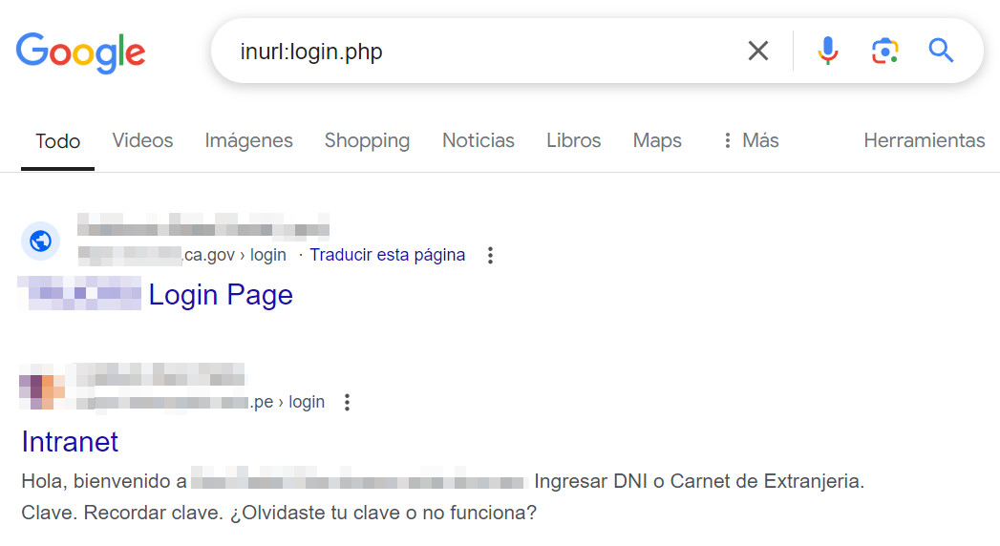

# OSINT
OSINT (Open Source Intelligence), se refiere a la recopilación y análisis de información que está disponible públicamente para obtener conocimientos relevantes y útiles sobre un objetivo en particular, por ejemplo una empresa a auditar. Esta busqueda y recopilación de datos se realiza en paginas de internet, foros, redes sociales y bases de datos accesibles sin necesidad de consultar fuentes confidenciales.

## Google dorks
El principal motor de busqueda del mundo ofrece filtros en sus resultados, una busqueda refinada podria llevarnos a encontrar subdominios, documentos alojados en servidores, suplantacion de paginas, credenciales en texto plano, etc.

A continuación listo los principales filtros y su uso:

```inurl:``` Este filtro se utiliza para encontrar solo resultados donde nuestra palabra clave se encuentre en la url, por ejemplo: ```inurl:login.php```




